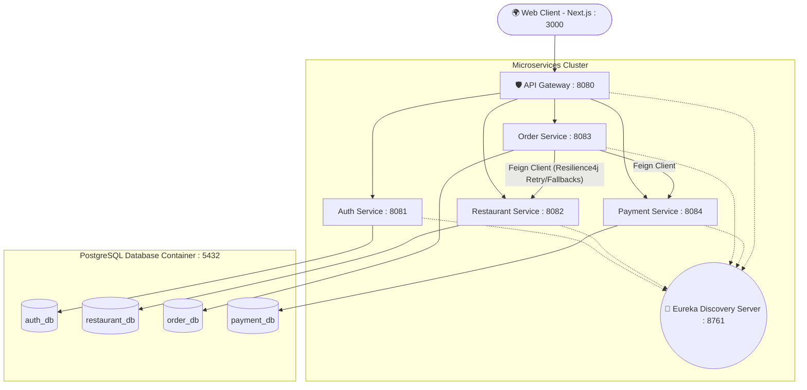

# 🍔 FoodieExpress — Microservices Food Delivery Platform

A production-ready, highly scalable food delivery web application built entirely on a microservices architecture. It features a complete guest-to-authenticated checkout flow, resilient inter-service communication, and dynamically generates over 10,000 localized food items across 10 major cities.

## 🏗️ Architecture Design

The backend is built around **Spring Cloud**, using a centralized API Gateway that routes traffic to specialized domains. Each service is entirely stateless, utilizing Eureka for dynamic discovery, and strictly manages its own isolated database to prevent coupling.



## 🔌 Service Port Map

The application consists of 6 core Java services, 1 Node frontend, and 1 Database container. 

| Component | Port | Internal Name | Description |
|-----------|------|---------------|-------------|
| **Frontend UI** | `3000` | `foodie-frontend` | Next.js 15 React web app handling all user views. |
| **API Gateway** | `8080` | `api-gateway` | The singular entry point. Validates JWTs, handles CORS, and routes traffic. |
| **Auth Service** | `8081` | `auth-service` | Handles User Registration, Login, and generates JWT tokens. |
| **Restaurant Service** | `8082` | `restaurant-service` | Exposes catalog, natively seeds 10,000 items, manages restaurants. |
| **Order Service** | `8083` | `order-service` | Order placement, cart-to-order logic, orchestration. |
| **Payment Service** | `8084` | `payment-service` | Simulated gateway that validates payment structures. |
| **Eureka Server** | `8761` | `discovery-server` | Service registry so microservices can locate each other. |
| **PostgreSQL** | `5432` | `foodie-postgres` | Hosts 4 highly isolated logical databases. |

---

## ⚡ Quick Start (Dockerized)

The absolute fastest way to boot the entire platform with all 8 containers mapped perfectly together:

```bash
docker-compose up --build -d
```
*(On first execution, the `restaurant-service` will take a few seconds upon startup to algorithmically generate 1,000 restaurants and 9,000 menu items. Please wait for the logs to clear).*

➡ **Open the Web App:** [http://localhost:3000](http://localhost:3000)

## 💻 Manual Local Development

If you prefer to run the components independently for development and debugging:

### 1. Requirements
- Java 21
- Node.js 22
- PostgreSQL 17 (Running on localhost:5432 with username: `postgres`, password: `postgres`)
- Gradle 8.12

### 2. Booting the Java Microservices
You **must** start the Discovery Server first, followed by the domain services, and the API Gateway last. Open multiple terminals and run:

```bash
# Terminal 1
cd backend/discovery-server && ./gradlew bootRun

# Terminal 2, 3, 4, 5
cd backend/auth-service && ./gradlew bootRun
cd backend/restaurant-service && ./gradlew bootRun
cd backend/order-service && ./gradlew bootRun
cd backend/payment-service && ./gradlew bootRun

# Terminal 6
cd backend/api-gateway && ./gradlew bootRun
```

### 3. Booting the Next.js Frontend
```bash
# Terminal 7
cd frontend
npm install
npm run dev
```

---

## 🚀 Features

### **Guest / User Experience**
- **Location Context:** Seamlessly browse catalogs specific to 10 mapped cities in Maharashtra (Mumbai, Pune, Nashik, etc).
- **Persistent Unauthenticated Cart:** Users can browse 10,000+ items, build large carts using dynamic `+` and `-` pill controls, and see live pricing without creating an account.
- **Smart Checkout Redirection:** Visitors are only gated and prompted to log in at the final checkout stage, immediately redirecting back to their cart upon success (Swiggy/Zomato style).
- **Tracking:** View your historical placed, confirming, and delivered orders.

### **Admin Dashboard**
- Create, Read, Update, and Delete actions for Restaurants and Menu Items.
- View global system orders.

## 🔐 Default Test Credentials

| Role | Email | Password | Access |
|------|-------|----------|--------|
| **Admin** | `admin@foodie.com` | `admin123` | Dashboard access, bypasses cart mechanics. |
| **User** | (Create one!) | - | End-to-end shopping & ordering pipeline. |

## 🛠️ Technical Highlights

*   **Resilience4j Circuit Breakers:** The `OrderService` wraps its synchronous `RestaurantService` HTTP checks in a `@CircuitBreaker` and `@Retry` mechanism. If the target service fails/lags, the order service gracefully falls back instead of halting or propagating crashes.
*   **Centralized JWT Authentication:** Tokens aren't painfully validated in every single microservice. The `api-gateway` intercepts all secure routes, verifies the JWT natively, and forwards trusted traffic downstream by appending a hardcoded `X-User-Id` header.
*   **Next.js 15 App Router:** Heavy contextual state management (`LocationProvider`, `CartProvider`) bypassing React hydration mismatches on client mount, paired with ultra-responsive global state UI elements (Floating Banners).
*   **Isolated Data Architecture:** 4 logically split databases enforcing strict domain-driven-design parameters. 
