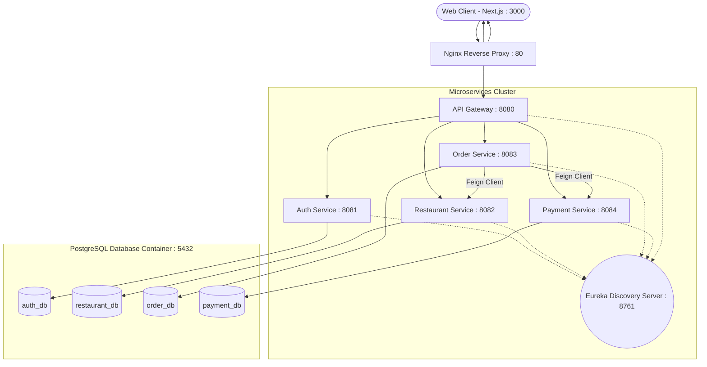

# FoodieExpress — Microservices Food Delivery Platform

A food delivery application built using microservices. It handles the full flow from browsing as a guest to placing an order as a logged-in user. The system uses localized data across 10 cities.

## Architecture Design

The backend uses **Spring Cloud** with an API Gateway that routes requests to specific services. Each service handles its own domain and database to keep them independent.



## Project Structure

```
food-delivery-microservices/
├── docker-compose.yml
├── docker/
│   ├── init-db.sh
│   └── nginx.conf
│
├── backend/
│   ├── discovery-server/          ← Service Registry
│   │   └── src/main/java/.../discovery/
│   │       ├── DiscoveryServerApplication.java
│   │       └── config/SecurityConfig.java
│   │
│   ├── api-gateway/               ← Gateway + JWT Filter
│   │   └── src/main/java/.../gateway/
│   │       ├── ApiGatewayApplication.java
│   │       ├── config/SecurityConfig.java
│   │       └── filter/JwtAuthFilter.java
│   │
│   ├── auth-service/              ← User Management + JWT
│   │   └── src/main/java/.../auth/
│   │       ├── AuthServiceApplication.java
│   │       ├── controller/AuthController.java
│   │       ├── dto/ (LoginRequest, RegisterRequest, AuthResponse)
│   │       ├── entity/User.java
│   │       ├── repository/UserRepository.java
│   │       ├── security/ (JwtUtil, SecurityConfig)
│   │       ├── seeder/AdminSeeder.java
│   │       └── service/AuthService.java
│   │
│   ├── restaurant-service/        ← Restaurants + Menus
│   │   └── src/main/java/.../restaurant/
│   │       ├── RestaurantServiceApplication.java
│   │       ├── controller/ (RestaurantController, MenuItemController)
│   │       ├── dto/ (RestaurantRequest/Response, MenuItemRequest/Response)
│   │       ├── entity/ (Restaurant, MenuItem)
│   │       ├── exception/ (GlobalExceptionHandler, ResourceNotFoundException)
│   │       ├── repository/ (RestaurantRepository, MenuItemRepository)
│   │       ├── seeder/DataSeeder.java
│   │       └── service/ (RestaurantService, MenuItemService)
│   │
│   ├── order-service/             ← Orders
│   │   └── src/main/java/.../order/
│   │       ├── OrderServiceApplication.java
│   │       ├── client/ (RestaurantClient, PaymentClient)
│   │       ├── controller/OrderController.java
│   │       ├── dto/ (OrderRequest/Response, OrderItemRequest/Response, ...)
│   │       ├── entity/ (Order, OrderItem, OrderStatus)
│   │       ├── exception/ (GlobalExceptionHandler, ResourceNotFoundException)
│   │       ├── repository/OrderRepository.java
│   │       └── service/OrderService.java
│   │
│   └── payment-service/           ← Payments
│       └── src/main/java/.../payment/
│           ├── PaymentServiceApplication.java
│           ├── controller/PaymentController.java
│           ├── dto/ (PaymentRequest, PaymentResponse)
│           ├── entity/ (Payment, PaymentStatus)
│           ├── exception/GlobalExceptionHandler.java
│           ├── repository/PaymentRepository.java
│           └── service/PaymentService.java
│
└── frontend/                      ← Next.js App
    └── src/
        ├── app/
        │   ├── layout.tsx
        │   ├── page.tsx                      (Home)
        │   ├── globals.css
        │   ├── login/page.tsx
        │   ├── register/page.tsx
        │   ├── restaurant/[id]/page.tsx      (Restaurant details)
        │   ├── cart/page.tsx
        │   ├── checkout/page.tsx
        │   ├── orders/page.tsx
        │   └── admin/
        │       ├── page.tsx                  (Dashboard)
        │       └── restaurant/[id]/page.tsx  (Edit Restaurant)
        ├── components/
        │   └── Navbar.tsx
        ├── context/
        │   ├── AuthContext.tsx
        │   ├── CartContext.tsx
        │   └── LocationContext.tsx
        └── lib/
            ├── api.ts
            └── types.ts
```

## Service Port Map

The application consists of 6 core Java services, 1 frontend, 1 Nginx proxy, and a Database.

| Component | Port | Container Name | Description |
|-----------|------|---------------|-------------|
| **Nginx Proxy** | `80` | `foodie-nginx` | Routes requests to the gateway or frontend. |
| **Frontend UI** | `3000` | `foodie-frontend` | Next.js app for the user interface. |
| **API Gateway** | `8080` | `foodie-gateway` | Entry point that validates JWTs and routes traffic. |
| **Auth Service** | `8081` | `foodie-auth` | User account and login handling. |
| **Restaurant Service** | `8082` | `foodie-restaurant` | Manages restaurant and menu data. |
| **Order Service** | `8083` | `foodie-order` | Manages orders and cart logic. |
| **Payment Service** | `8084` | `foodie-payment` | Simulates payment processing. |
| **Eureka Server** | `8761` | `foodie-discovery` | Registry for service instances. |
| **PostgreSQL** | `5432` | `foodie-postgres` | Postgres with separate databases for each service. |

---

## Quick Start

Start the entire platform using Docker:

```bash
docker-compose up --build -d
```
*(On first run, the `restaurant-service` takes a moment to generate the initial data for restaurants and menu items).*

**Open the Web App:** [http://localhost](http://localhost)

## Manual Setup

To run components individually:

### 1. Requirements
- Java 21
- Node.js 22
- PostgreSQL 17 (Running on localhost:5432)
- Gradle 8.12

### 2. Run Backend Services
Start the Discovery Server first, then the other services, and the API Gateway last.

```bash
# Start Eureka
cd backend/discovery-server && ./gradlew bootRun

# Start services
cd backend/auth-service && ./gradlew bootRun
cd backend/restaurant-service && ./gradlew bootRun
cd backend/order-service && ./gradlew bootRun
cd backend/payment-service && ./gradlew bootRun

# Start Gateway
cd backend/api-gateway && ./gradlew bootRun
```

### 3. Run Frontend
```bash
cd frontend
npm install
npm run dev
```

---

## Features

### **Guest / User Experience**
- **Location:** Browse restaurants based on the selected city.
- **Cart:** Add items to your cart without being logged in. Controls allow increasing or decreasing quantities.
- **Checkout:** Users are prompted to log in only at the final checkout step.
- **Tracking:** View your order history and status.

### **Admin Tools**
- Manage restaurants and menu items.
- View system orders.

## Credentials

| Role | Email | Password |
|------|-------|----------|
| **Admin** | `admin@foodie.com` | `admin123` |
| **User** | (Create one!) | - |

## Technical Details

*   **Resilience:** `OrderService` uses retries when calling other services.
*   **Security:** `api-gateway` checks JWT tokens and adds user information to the headers for downstream services.
*   **State Management:** The frontend uses React context to manage location, cart, and authentication.
*   **Data:** Separate databases are used for each service to maintain independence.

## API Endpoints

### Restaurant Service
| Method | Endpoint | Description |
|--------|----------|-------------|
| `GET` | `/api/restaurants` | Get all restaurants |
| `GET` | `/api/restaurants/city/{city}` | Get restaurants filtered by city |
| `GET` | `/api/restaurants/{id}` | Get restaurant by ID |
| `POST` | `/api/restaurants` | Create a restaurant |
| `PUT` | `/api/restaurants/{id}` | Update a restaurant |
| `DELETE` | `/api/restaurants/{id}` | Delete a restaurant |
| `GET` | `/api/menu-items/restaurant/{id}` | Get menu items for a restaurant |

### Auth Service
| Method | Endpoint | Description |
|--------|----------|-------------|
| `POST` | `/api/auth/register` | Register a new user |
| `POST` | `/api/auth/login` | Login and receive JWT |

### Order Service
| Method | Endpoint | Description |
|--------|----------|-------------|
| `POST` | `/api/orders` | Place a new order |
| `GET` | `/api/orders` | Get orders for authenticated user |

### Payment Service
| Method | Endpoint | Description |
|--------|----------|-------------|
| `POST` | `/api/payments` | Process a payment |

